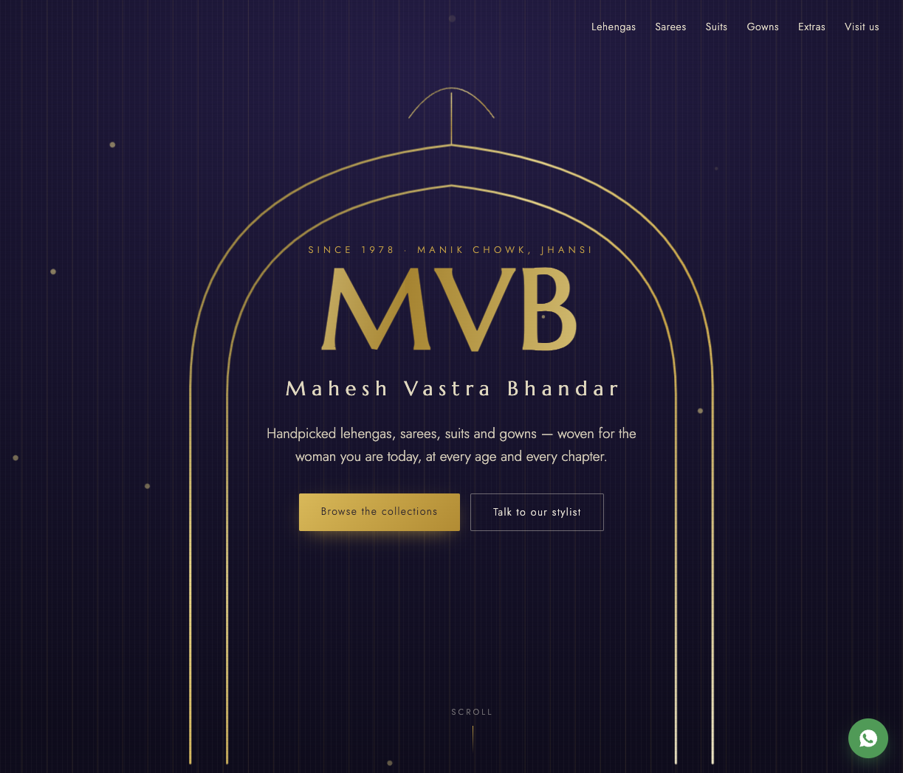
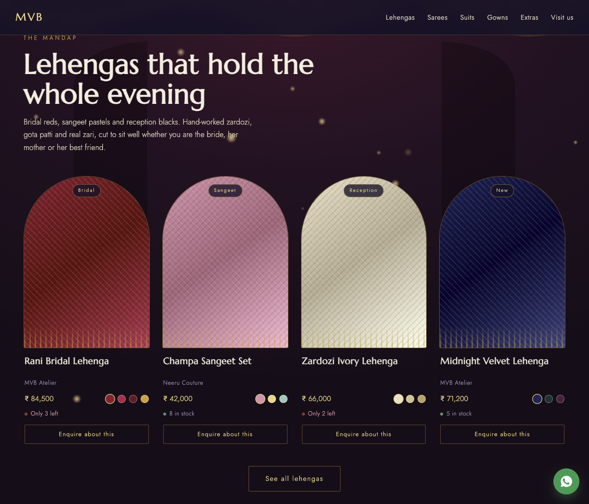
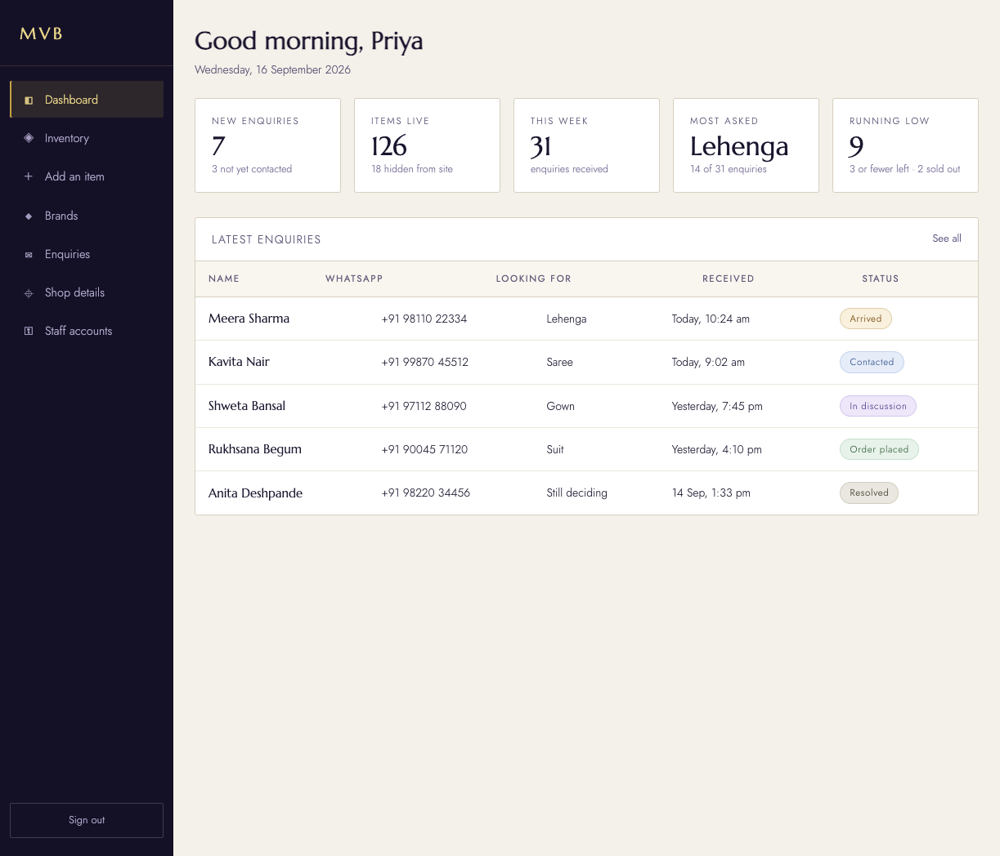

<p align="center">
  
</p>

# Mahesh Vastra Bhandar

**Indian ethnic wear for every woman — since 1978, Manik Chowk, Jhansi.**

The website for [Mahesh Vastra Bhandar](https://github.com/mayankag30/mvb): a storefront to browse lehengas, sarees, suits, gowns and extras, and a staff panel to run inventory and WhatsApp enquiries.

There is no cart, no checkout, and no payment flow. Shoppers leave a number; the team replies on WhatsApp with more photos, daylight videos, sizes, colours, and a plan to visit or deliver.

> Handpicked lehengas, sarees, suits and gowns — woven for the woman you are today, at every age and every chapter.

---

## Glimpses

<p align="center">
  
</p>

<p align="center"><em>The Mandap — bridal reds, sangeet pastels, reception ivories. Enquire, do not add to bag.</em></p>

<p align="center">
  
</p>

<p align="center"><em>Staff panel — new enquiries, live stock, and the conversation from arrived to order placed.</em></p>

---

## Collections

Each world on the homepage has its own light, copy, and a short rack. **See all** opens filters for colour family, brand, price, occasion, and stock.

| Collection | Mood | What you will find |
|---|---|---|
| **Lehengas** | The mandap | Bridal reds, sangeet pastels, reception blacks. Zardozi, gota patti, real zari. |
| **Sarees** | After dark, any city | Kanjeevaram, Banarasi, organza, hand-painted chiffon. |
| **Suits** | Hill air, sea air | Chanderi, cotton silk, Lucknowi chikankari, easy Anarkalis. |
| **Gowns** | Centre stage | Indo-western silhouettes, capes, corseted bodices. |
| **Extras** | Finishing touches | Dupattas, jewellery, potlis, belts, juttis. |

The store sits on Chandra Shekhar Azad Road, Manik Chowk, Jhansi, Uttar Pradesh 284002. Hours: Monday to Saturday, 11am–8pm. Sunday closed.

---

## How a sale actually happens

1. A customer browses a collection and taps **Enquire about this**.
2. They send a name and WhatsApp number (optional email, occasion, colour).
3. Staff see it land as **Arrived**, then walk it through contacted → in discussion → order placed.
4. Fabric is shown on video in daylight before anyone commits. Alterations — blouse stitching, fall-pico, lehenga and gown fitting — are part of the shop, not an add-on SKU.

A floating WhatsApp button stays on the storefront for people who would rather message first.

---

## Staff panel

Protected at `/admin`. Staff can:

- Publish, hide, or retire pieces without deleting history
- Upload photos and video (Cloudinary, signed)
- Track stock and low-stock warnings
- Manage brands without breaking items
- Update shop name, hours, map pin, and WhatsApp number (those values feed the public site)

---

## Stack

| Layer | Choice |
|---|---|
| App | Next.js (App Router), TypeScript, React 19 |
| Look | Ported from `design-reference/` — gold zari, ivory, rani, Marcellus + Jost. Do not redesign. |
| Data | Supabase Postgres (`ap-south-1`) when `DATA_SOURCE=supabase`; otherwise a rich mock for local browsing |
| Auth | Supabase email + password. Public signup off. |
| Media | Cloudinary |
| Bots | Cloudflare Turnstile on the enquiry form |
| Map | OpenStreetMap embed |

---

## Run it locally

```bash
npm install
npm run dev
```

Open [http://127.0.0.1:3000](http://127.0.0.1:3000). Without env vars the mock catalogue is enough to walk the storefront.

```bash
npm test   # migration order + unit tests
npm run lint
npm run build
```

### Production data

Create `.env.local` (never commit it):

```bash
DATA_SOURCE=supabase

NEXT_PUBLIC_SUPABASE_URL=
NEXT_PUBLIC_SUPABASE_ANON_KEY=
SUPABASE_SERVICE_ROLE_KEY=

CLOUDINARY_CLOUD_NAME=
CLOUDINARY_API_KEY=
CLOUDINARY_API_SECRET=

NEXT_PUBLIC_TURNSTILE_SITE_KEY=
TURNSTILE_SECRET_KEY=
```

Apply `supabase/migrations/` in numeric order (`0001` … `0005`). See `supabase/migrations/README.md` — later files depend on earlier ones; do not skip `0004` or every item reads as sold out.

---

## Project map

```
src/app/                 Storefront, collection pages, enquiry action
src/app/admin/           Dashboard, inventory, brands, enquiries, shop, staff
src/components/          Storefront worlds + admin forms
src/lib/data/            Mock and Supabase behind one seam
design-reference/        Approved visual source of truth
supabase/migrations/     Schema, RLS, stock, brands
```

The design is finished. `design-reference/index.html` and `design-reference/admin.html` own colour, type, motion, and copy. The Next app ports them; it does not improve them.

---

© 2026 Mahesh Vastra Bhandar. Browsing only — orders are confirmed over WhatsApp with the team.
